[comment]: # "This is the standard layout for the project, but you can clean this and use your own template"

# Hand Gesture Recognition using sEMG

#### Team

- E/15/043, Yasiru Bhagya T.P., [yasirubhagya@eng.pdn.ac.lk](mailto:yasirubhagya@eng.pdn.ac.lk)
- E/15/131, Hisni Mohammed M.H., [hisnimohammed@eng.pdn.ac.lk](mailto:hisnimohammed@eng.pdn.ac.lk)
- E/15/348, Suhail S., [suhailsajahan@eng.pdn.ac.lk](mailto:suhailsajahan@eng.pdn.ac.lk)

#### Supervisors

- Dr. Isuru Nawinne, [isurunawinne@eng.pdn.ac.lk](mailto:isurunawinne@eng.pdn.ac.lk)
- Prof. Roshan Ragel, [roshanr@eng.pdn.ac.lk](mailto:roshanr@eng.pdn.ac.lk)
- Mr. Theekshana Dissanayake, [theekshanadis@eng.pdn.ac.lk](mailto:theekshanadis@eng.pdn.ac.lk)

#### Table of content

1. [Abstract](#abstract)
2. [Related works](#related-works)
3. [Methodology](#methodology)
4. [Experiment Setup and Implementation](#experiment-setup-and-implementation)
5. [Results and Analysis](#results-and-analysis)
6. [Conclusion](#conclusion)
7. [Links](#links)

---

## 1. Abstract
Identifying hand gestures using surface electromyography (sEMG) signals is vital in the development of next-generation human-machine interfaces (HMI). sEMG based HMIs provide users with a more natural and convenient way to communicate with computing systems. sEMG signals recorded from muscle tissues give information about the intended muscle movements triggered by the brain waves. Identifying these movements allows developing interfaces that can control computing devices. In this research, an attempt was made to improve a hand gesture recognition model that could be used as a human-machine interface using an online open dataset of sEMG signals. First sEMG signals were preprocessed using a bandpass filter and notch filter to remove noises in the signal. Then various time, frequency, and time-frequency domain features extracted and they were fed into machine learning algorithms such as random forest, support vector machines (SVM), K-nearest neighbors (K-NN), and recurrent neural networks. All the results were validated using 10-fold cross-validation. Maximum testing accuracy of 90.03% was obtained using an SVM classifier with root mean square, mean frequency, and median frequency of the signal as features for 24 channel data. Later an attempt was also made to use this result to control a simple game developed in Unity using sEMG signals collected from an 8-channel signal acquisition device.

## 2. Related works
Various approaches have been proposed in the area of EMG-based applications. As sEMG signals from different muscle groups exhibit different characteristics, different techniques have been employed to characterize muscle movement. But in general, it is all down to feature extraction to represent the signal as a vector of features, followed by feature selection to reduce the vector’s dimensionality, and finally, classification to determine each vector as belong to one of a fixed set of classes [5].
Paleari et al. [6] have used the root mean square (RMS) feature with a neural network model to classify hand movements using 192 channel high-density sEMG (HD-sEMG) signals from the forearm. Stango et al. [7] have used the SVM classifier with variogram, which is a measure of the degree of spatial correlation to build a model to control upper limb prostheses using HD-sEMG signals. Liu et al. [8] proposed an invariant feature extraction (IFE) framework based on kernel fisher discriminant analysis to enhance the robustness of myoelectric pattern recognition. Tsai et al. [9] proposed multi-channel EMG-based motion pattern recognition. They have used the SVM classifier with STFT-ranking features based on short-time Fourier transform and principal component analysis to feature selection. Amma et al. [10] used HD-sEMG signals recorded by 192 electrodes to classify finger gestures using the RMS feature and a naive Bayes classifier. Most of these researches based on HD-sEMG signals and complex feature extraction with complex deep learning models that give higher accuracy are not suitable to implement in a real-time environment as they have higher latencies, expensive in terms of electrode configuration, and inconvenient for the user. 

## 3. Methodology
### 3.1. Data Set
An online open dataset “putEMG” [4] published by Kaczmarek et al. was used for our research. This dataset is a database of sEMG signals collected through an experiment conducted on a group of 45 subjects. This group consisted of 37 males and 8 females aged between 19 and 37 years old. To record sEMG signals, a signal acquisition device with 24 electrodes placed in 3 elastic bands such that 8 electrodes per elastic band was used. Signals were recorded from right forearm muscles. The signals were sampled at the rate of 5120 Hz, with a 12-bit analog to digital converter.
The sEMG signals were recorded when subjects were not moving the hand-keeping the muscles relaxed (idle gesture), when hand fist, while flexion of the hand, while the extension of the hand, and while pinching the fingers (pinching with thumb and index finger, pinching with thumb and middle finger, pinching with thumb and ring finger, and pinching with thumb and small finger). Therefore, this dataset includes the idle gesture and 7 active gestures. Figure 1 shows all the gestures that are included in the dataset and Figure 2 shows the electrode placement configurations used to acquire signals.
It is very important to record sEMG signals when subjects perform gestures repetitively as when doing the same gesture again and again subjects tend to perform gestures in a similar pattern [4]. putEMG dataset was created using an experiment that was conducted such that each data instance consists of 20 repetitions of each gesture. Therefore, this dataset allows us to develop and evaluate more robust algorithms for gesture recognition systems.

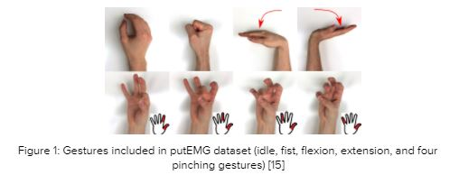

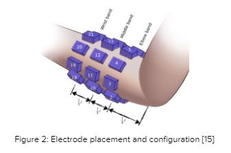

### 3.2. Data Preprocessing
putEMG data contains raw sEMG signals directly collected from the muscles therefore these signals contain noises. Due to the amplifier's direct current offsets, the signals will have low-frequency noises and due to electronic devices (computers, radio broadcasts, etc.), the signal will have high-frequency noises [16]. Typically, sEMG signals are within the 10-700 Hz frequency range and signals beyond this range are considered not useful. Furthermore, sEMG signals may contain interference noises generated by the main power line and other equipment used during the acquisition of data. Therefore, a 5th order bandpass filter of range 20 and 700 Hz was used to filter out low, high-frequency noises, and an adaptive notch filter (ANF) was used to reduce interferences. Attenuating frequencies used for ANF were 30, 50, 90, 60, and 150 Hz. These filter parameters were determined using the suggestions made by the true authors of the dataset [4].  Figure 3 shows the sEMG signals before and after using a bandpass and notch filter. Furthermore, each active gesture in the dataset is of 1 second or 3 seconds, separated by a 3-second idle gesture. Therefore, the dataset contains more ‘idle’ gestures than any other active gestures hence the dataset is unbalanced. Therefore, extra idle gestures were removed to balance the dataset.

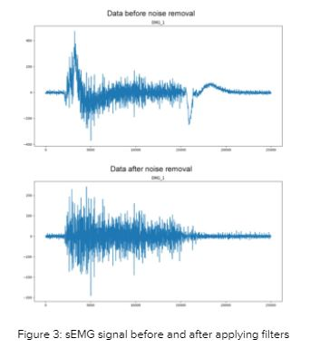

### 3.3. Feature Extraction
For the classification using classic machine learning models, ten features from time, frequency, time-frequency domains were extracted from each channel. They were integral absolute value, mean absolute value, mean frequency, median frequency, root mean square, slope sign change, variance, waveform length, Willison amplitude, zero-crossing, and Mel-frequency cepstral coefficients. In previous works, it is found that these features give higher performance, high insensitivity to window size, and low computational complexity [17].
Root mean square (RMS) which is a time-domain feature gives insights into the amplitude of the signals. The amplitude of the sEMG signal is related to the contraction level of muscles and muscle force involved during the movements. this feature was calculated as,

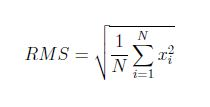

sEMG signal frequencies vary with different muscle movements.  Therefore, frequency domain features such as mean frequency (MNF) and median frequency (MDF) of the signal are also used in the feature vector that is fed into gesture recognition classifiers. These features were calculated as,

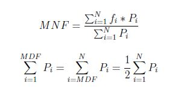

Other time domain features mean absolute value (MAV), wave-length (WL), variance (VAR), slope sign change (SSC), and Willison amplitude (WAMP) were calculated as follows,

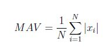
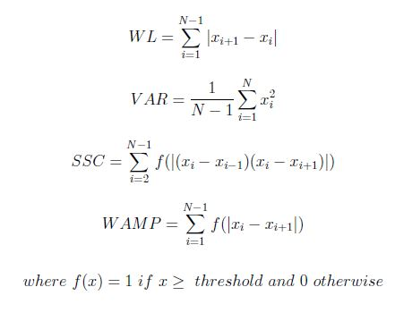

To find Mel-frequency cepstral coefficients (MFCC), the mfcc function from the librosa python library is used. While calculating these features sliding windows size of 2048 and hop length size of 1024 is used. These extracted features were grouped into four separate sets and fed into classifiers separately. The first feature set consists of root mean square, mean frequency, and median frequency. The feature sets II and III were based on previous studies. The second feature set is based on the suggestion made by Hudgins et al. [18] which consists of features mean absolute value, wave-length, zero-crossing, slope sign change. The third feature set consists of integral absolute value, variance, wave-length, zero-crossing, slope sign change, and Willison amplitude was proposed by Du et al. [19]. Finally, feature set IV is made up of MFCC data. Moreover, both preprocessed data and MFCC data were used to train the neural network models.

### 3.4. Classification
Classic machine learning classifier models and deep learning were used to identify eight gestures: idle, fist, flexion, extension, pinching with thumb and index finger, pinching with thumb and middle finger, pinching with thumb and ring finger, and pinching with thumb and small finger. Classic machine learning models used are k-nearest neighbors (k-NN), random forest (RF), support vector machine (SVM), and linear discriminant analysis (LDA). Two sets of data, one with features extracted from all 24 channels data and another with features extracted from 8 channel data were fed into these classifiers.

The grid search algorithm [20] is used for optimizing parameters for classifier models. To evaluate the classifier models, 10-Fold cross-validation was used. All of the classic machine learning algorithms, the grid search algorithm, and cross-validation used were taken from Python scikit-learn API [20].
Furthermore, we experimented with two types of neural networks, the long-short-term memory (LSTM) model and the LSTM with convolutional neural network (CNN) model. Extracted MFCC data was fed to the neural network. Neural networks were implemented using TensorFlow with Keras in python language. The first model is a basic model with two LSTM layers and one dense layer to output each class. Here class labels were one-hot encoded and categorical cross-entropy was used as the error function. Figure 3.4 shows more details about the LSTM model. Figure 3.5 shows LSTM-CNN model parameters.

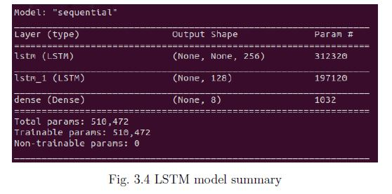

## 4. Experiment Setup and Implementation
### 4.1. Signal Acquisition Device
Our device is inspired by the Backyard Brains’ Muscle SpikerShield device. Muscle SpikerShield has 6 channels of sEMG signal acquisition capability. To use it we have to connect it to an Arduino board. On the other hand, our device has 8 channels, a dedicated 8 channel ADC and a powerful STM32F103 microcontroller. Figure 3.6 shows the high-level view of our device and Figure 3.7 shows the circuit diagram for a single channel. Figure 3.8 and Figure 3.9 Illustrates the printed circuit board (PCB) layout of our device. Figure 3.10 shows our final signal acquisition device and Figure 3.11 shows the the 8 channel electrode band.

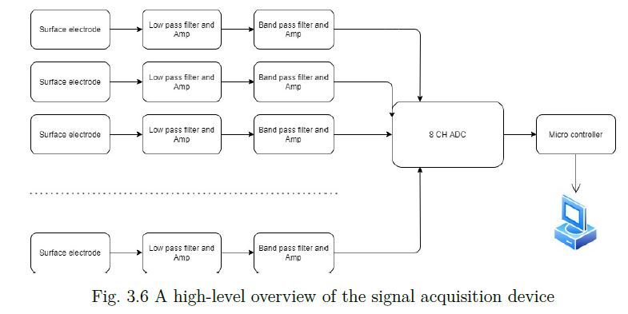

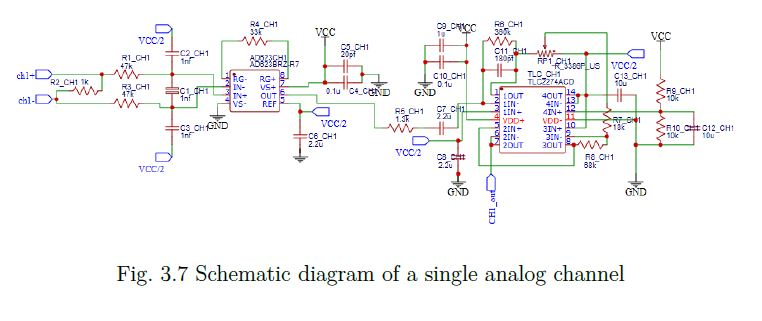

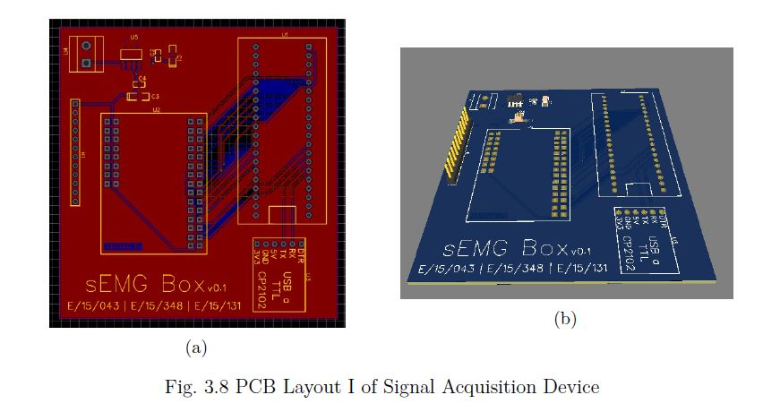

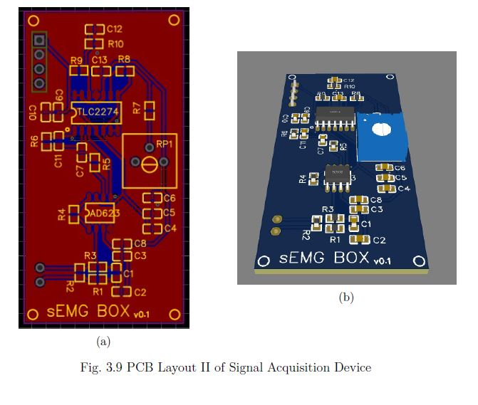

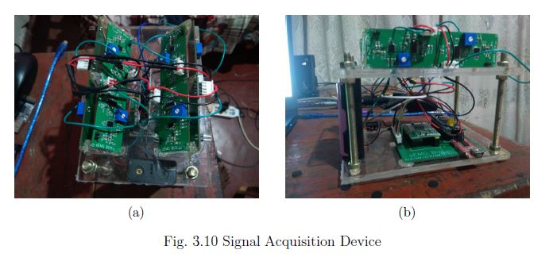

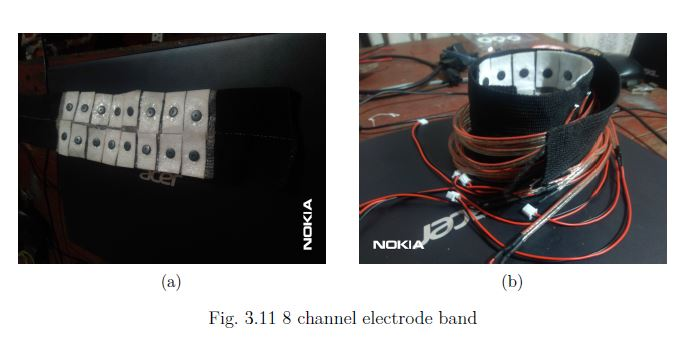

### 4.2. The Game
A game similar to the space invader game has been created to demonstrate the project. The device will recognize the gesture, then the gesture will be classified through the machine learning algorithms and then the movement of the spaceship can be changed according to the assigned gesture for each movement. The game has been created using the Pygame library, which is a python library mostly used to build games. To make the game interesting, we have created the game with an environment that is similar to the current pandemic situation. The covid19 viruses come towards the earth and the player has to protect the earth from the virus by shooting it from the spaceship. The spaceship can be moved in all 8 directions using the arrow keys and it can fire using the space key. If the covid19 virus reaches the earth or comes near to the spaceship then the game will be ended. Figure 3.12 shows the interface of our game.

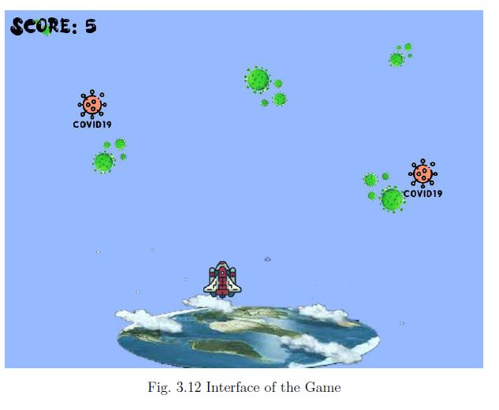

### 4.3. Real-Time Controlling
An attempt was made to control the game using the 8 channel signal acquisition device
developed by us. The first signal acquired by the device was filtered using 5th order
bandpass filter of range 20 and 700 Hz. Then root mean square, mean frequency, and
median frequency of the signal were extracted and fed to support vector machine classifiers
as features to identify the gestures. Figure 3.13 shows our signal acquisition device while
testing.

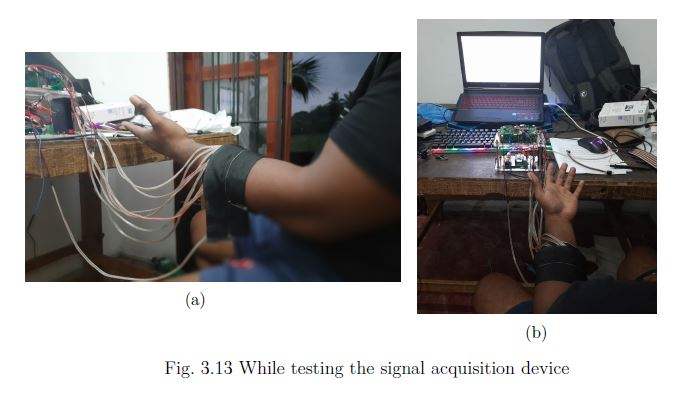

## 5. Results and Analysis
Feature Set I: root mean square, mean frequency, median frequency
Feature Set II: mean absolute value, wave-length, zero-crossing, slope sign change.
Feature Set III: integral absolute value, variance, wave-length, zero-crossing, slope sign change, and Willison amplitude
Feature Set IV: Mel-frequency cepstral coefficients
 
Classifier models: linear discriminant analysis, k-nearest neighbor, support vector machine, random forest

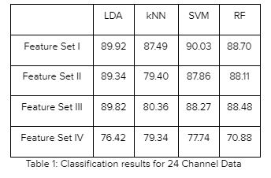

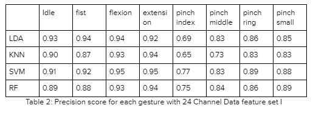

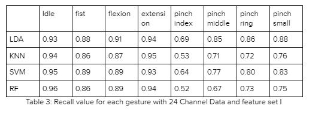

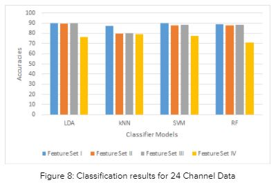

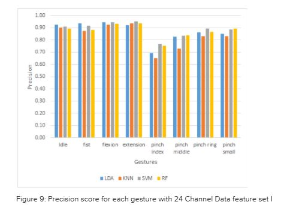

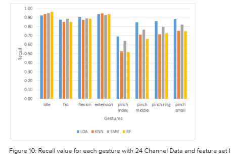

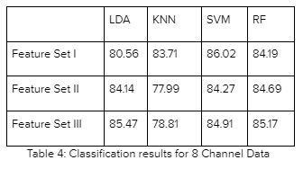

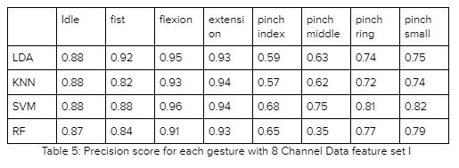

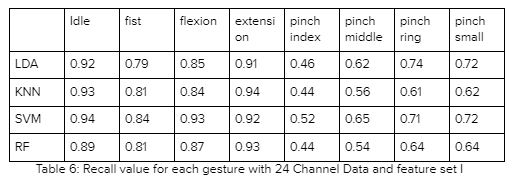

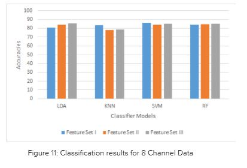

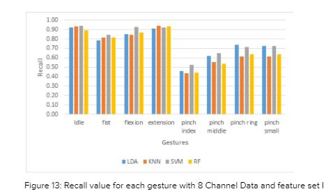

Table 1 and Figure 8 illustrate the validation results obtained for different classifier models with different feature sets using 24 channel data. According to the results feature set I which consists of root mean square (RMS), mean frequency, and median frequency, gives the best result for all classifier models. Furthermore, the support vector machine (SVM) classifier gives the highest accuracy of 90.3% for 24 channel data. The linear discriminant analysis (LDA) model has the second-best accuracy of 89.92%. Feature set IV has the lowest accuracy for all the classifier models.
Table 2 and Figure 9 illustrate the precision score for each gesture when different classifiers are used with feature set I and 24 channel data. Similarly, Table 3 and Figure 10 illustrate the recall value for each gesture when different classifiers are used with feature set I and 24 channel data. Results from Table 2 and Table 3 for we can see that idle, fist, flexion, and extension gestures have higher precision and recall scores, that is all the classifier models tend to predict more accurately these sets of gestures than pinching gestures. Idle gestures are correctly classified by the random forest classifier model with the highest recall score of 0.96 and fist gestures are correctly identified by the SVM classifier with the highest recall of 0.89. LDA has the highest recall for flexion and extension of hand with scores of 0.91 and 0.94 respectively. Pinching thumb with index finger have the lowest recall value for all the classifiers with the best recall score being 0.64 with the LDA classifiers. Other pinching gestures are also correctly identified by the LDA model with the highest recall values of 0.85, 0.86, and 0.88 for pinch thumb-middle, pinch thumb-ring, and pinch thumb-small gestures.
Table 4 and Figure 11 illustrate the classifier results for 8 channel data. For classifying 8 gestures, the highest accuracy of 86.02% was achieved using the SVM classifier with feature set I. LDA model performed better with the feature set III achieving an accuracy of 85.47% and the random forest model also performed better with the feature set III with an accuracy of 85.17%.
Table 5 and Table 6 illustrate the precision score and recall value respectively for each gesture when different classifiers are used with feature set I and 8 channel data. The same result is graphically illustrated in Figures 12 and 13. Similar to 24 channel data results pinching finger gestures had low precision and recall values compared to the other 4 gestures. Predicting idle, fist, and flexion of hand have the highest recall value when SVM classifier is used while k-nearest neighbor classifier predicts extension of hand more accurately with the recall value of 0.94. For pinching fingers, SVM predicted more accurately with the highest recall values of 0.52, 0.65, and 0.72 for pinch thumb-index, pinch thumb-middle, and pinch thumb-small gestures. 

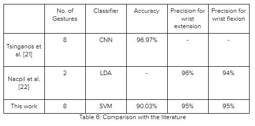

Few researchers have worked on the putEMG dataset for different sEMG applications, and Table 6 illustrates the results obtained. Tsinganos et al. [21] have worked on data augmentation methods and with the use of these techniques, they have achieved a maximum testing accuracy of 96.97%. Our results do not match with their results but their research was mainly based on data augmentation techniques that are to create new data from existing data. The performance of machine learning models improves with the amount of data available. This could be the reason that they have achieved higher accuracy. Nacpil et al. [22] have worked on creating a model to control steering wheel for drivers with disabilities and they have achieved a precision score of 96% and 94% for extension and flexion of the hand. We have achieved a precision of 95% for both of these gestures using the SVM classifier with feature set I and also we are classifying eight gestures.

## 6. Conclusion
The objective of this research was to find a hand gestures recognition model that could be useful to interact with machine interfaces using sEMG signals. If we consider results obtained for 24 channel data, the difference in classification accuracies achieved by LDA and SVM are insignificant for feature set I. From precision and recall results also suggest that both LDA and SVM classifiers have similar results. If we consider results obtained for 8 channel data, the SVM classifier with the feature set I performed better. Precision and recall results also suggest that the SVM classifier gives a better result. In both cases, pinching gestures were not accurately classified compared to other gestures: idle, fist, flexion, and extension gestures. Therefore, a system that utilizes a support vector machine classifier with root mean square, mean frequency, and median frequency as features could be adopted to implement an end-user human-machine interface that utilizes limited gestures. This system might not be very useful for classifying pinching gestures as they have lower precision and recall values, and on average they are below 70%.
sEMG signals characteristic from different muscle groups and characteristics of a single muscle group of different locations have variations. These results obtained depend on the muscle location where signals are acquired and the signal acquisition device used in the experiment. Therefore, when implementing a real-world end-user system these factors also need to be considered.

## References
[1]  	T. M. M. V. M.A. Cavalcanti Garcia, “Surface electromyography: Why, when and how to use it,” Acta Médica Colomb., vol. 43, no. 2S, p. 176, 2019, doi: 10.36104/amc.2018.1400.

[2]  	M. B. I. Reaz, M. S. Hussain, and F. Mohd-Yasin, “Techniques of EMG signal analysis: Detection, processing, classification and applications,” Biol. Proced. Online, vol. 8, no. 1, pp. 11–35, 2006, doi: 10.1251/bpo115.

[3]  	W. Wei, Y. Wong, Y. Du, Y. Hu, M. Kankanhalli, and W. Geng, “A multi-stream convolutional neural network for sEMG-based gesture recognition in muscle-computer interface,” Pattern Recognit. Lett., vol. 119, pp. 131–138, 2019, doi: 10.1016/j.patrec.2017.12.005.

[4]  	P. Kaczmarek, T. Mánkowski, and J. Tomczýnski, “PutEMG—A surface electromyography hand gesture recognition dataset,” Sensors (Switzerland), vol. 19, no. 16, 2019, doi: 10.3390/s19163548.

[5]  	A. Jaramillo-Yánez, M. E. Benalcázar, and E. Mena-Maldonado, “Real-time hand gesture recognition using surface electromyography and machine learning: A systematic literature review,” Sensors (Switzerland), vol. 20, no. 9, pp. 1–36, 2020, doi: 10.3390/s20092467.

[6]  	M. Atzori et al., “Characterization of a benchmark database for myoelectric movement classification,” IEEE Trans. Neural Syst. Rehabil. Eng., vol. 23, no. 1, pp. 73–83, 2015, doi: 10.1109/TNSRE.2014.2328495.

[7]  	V. H. Cene, M. Tosin, J. Machado, and A. Balbinot, “Open database for accurate upper-limb intent detection using electromyography and reliable extreme learning machines,” Sensors (Switzerland), vol. 19, no. 8, 2019, doi: 10.3390/s19081864.

[8]  	F. Giordaniello et al., “Megane Pro: Myo-electricity, visual and gaze tracking data acquisitions to improve hand prosthetics,” IEEE Int. Conf. Rehabil. Robot., pp. 1148–1153, 2017, doi: 10.1109/ICORR.2017.8009404.

[9]  	Y. Du, W. Jin, W. Wei, Y. Hu, and W. Geng, “Surface EMG-based inter-session gesture recognition enhanced by deep domain adaptation,” Sensors (Switzerland), vol. 17, no. 3, pp. 6–9, 2017, doi: 10.3390/s17030458.

[10]	C. Amma, T. Krings, J. Böer, and T. Schultz, “Advancing muscle-computer interfaces with high-density electromyography,” Conf. Hum. Factors Comput. Syst. - Proc., vol. 2015-April, pp. 929–938, 2015, doi: 10.1145/2702123.2702501.

[11]	M. Paleari, M. Di Girolamo, N. Celadon, A. Favetto, and P. Ariano, “On optimal electrode configuration to estimate hand movements from forearm surface electromyography,” Proc. Annu. Int. Conf. IEEE Eng. Med. Biol. Soc. EMBS, vol. 2015-Novem, pp. 6086–6089, 2015, doi: 10.1109/EMBC.2015.7319780.

[12]	A. Stango, F. Negro, and D. Farina, “Spatial Correlation of High Density EMG Signals Provides Features Robust to Electrode Number and Shift in Pattern Recognition for Myocontrol,” IEEE Trans. Neural Syst. Rehabil. Eng., vol. 23, no. 2, pp. 189–198, Mar. 2015, doi: 10.1109/TNSRE.2014.2366752.

[13]	J. Liu, D. Zhang, X. Sheng, and X. Zhu, “Enhanced robustness of myoelectric pattern recognition to across-day variation through invariant feature extraction,” Proc. Annu. Int. Conf. IEEE Eng. Med. Biol. Soc. EMBS, vol. 2015-Novem, no. 1, pp. 7262–7265, 2015, doi: 10.1109/EMBC.2015.7320068.

[14]	A. C. Tsai, J. J. Luh, and T. Te Lin, “A novel STFT-ranking feature of multi-channel EMG for motion pattern recognition,” Expert Syst. Appl., vol. 42, no. 7, pp. 3327–3341, 2015, doi: 10.1016/j.eswa.2014.11.044.

[15]	P. Kaczmarek, T. Mánkowski, and J. Tomczýnski, “putEMG: sEMG Gesture and Force Recognition Datasets – Biomedical Engineering and Biocybernetics Team.” https://biolab.put.poznan.pl/putemg-dataset/ (accessed Feb. 16, 2021).

[16]	H. A. Yousif et al., “Assessment of Muscles Fatigue Based on Surface EMG Signals Using Machine Learning and Statistical Approaches: A Review,” IOP Conf. Ser. Mater. Sci. Eng., vol. 705, p. 012010, Dec. 2019, doi: 10.1088/1757-899X/705/1/012010.

[17]	M. A. Oskoei and H. Hu, “Support vector machine-based classification scheme for myoelectric control applied to upper limb,” IEEE Trans. Biomed. Eng., vol. 55, no. 8, pp. 1956–1965, 2008, doi: 10.1109/TBME.2008.919734.

[18]	B. Hudgins, P. Parker, and R. N. Scott, “A New Strategy for Multifunction Myoelectric Control,” IEEE Trans. Biomed. Eng., vol. 40, no. 1, pp. 82–94, 1993, doi: 10.1109/10.204774.

[19]	Y. C. Du, C. H. Lin, L. Y. Shyu, and T. Chen, “Portable hand motion classifier for multi-channel surface electromyography recognition using grey relational analysis,” Expert Syst. Appl., vol. 37, no. 6, pp. 4283–4291, 2010, doi: 10.1016/j.eswa.2009.11.072.

[20]	F. Pedregosa et al., “Scikit-learn: Machine learning in Python,” J. Mach. Learn. Res., vol. 12, no. May 2014, pp. 2825–2830, 2011.

[21]	P. Tsinganos, B. Cornelis, J. Cornelis, B. Jansen, and A. Skodras, “Data augmentation of surface electromyography for hand gesture recognition,” Sensors (Switzerland), vol. 20, no. 17, pp. 1–23, 2020, doi: 10.3390/s20174892.

[22]	E. J. Nacpil and K. Nakano, “Driving Simulator Validation of Machine Learning Classification for a Surface Electromyography-Based Steering Assistance Interface,” Adv. Intell. Syst. Comput., vol. 1206 AISC, pp. 143–149, 2021, doi: 10.1007/978-3-030-51064-0_19.

## Links

- [Project Repository](https://github.com/cepdnaclk/{{ page.repository-name }}){:target="_blank"}
- [Project Page](https://cepdnaclk.github.io/{{ page.repository-name}}){:target="_blank"}
- [Department of Computer Engineering](http://www.ce.pdn.ac.lk/){:target="_blank"}
- [University of Peradeniya](https://eng.pdn.ac.lk/){:target="_blank"}

[//]: # "Please refer this to learn more about Markdown syntax"
[//]: # "https://github.com/adam-p/markdown-here/wiki/Markdown-Cheatsheet"
